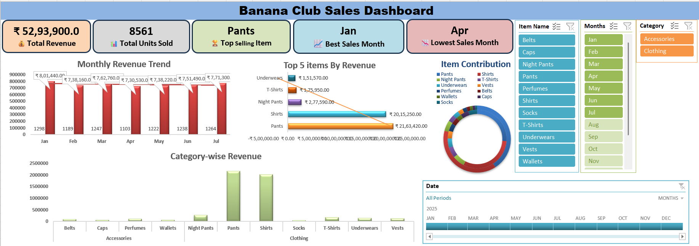

# 📊 Banana Club Sales Dashboard

A dynamic Excel-based dashboard analyzing 8,500+ retail transactions from Banana Club. This project demonstrates data cleaning, KPI tracking, and visual storytelling—essential skills for any aspiring data analyst.

---

## 📌 Project Summary

- **Client:** Banana Club (Retail Clothing & Accessories)
- **Tool Used:** Microsoft Excel
- **Dataset Size:** 8,561 transactions
- **Reporting Period:** January to July 2025
- **Objective:** Deliver actionable insights through interactive dashboards

---

## 🔍 Key Business Insights

| Metric                 | Value              |
|----------------------  |--------------------|
| 💰 Total Revenue      | ₹52,93,900          |
| 📦 Total Units Sold   | 8,561               |
| 🥇 Top-Selling Item   | Pants (₹21,63,420)  |
| 📈 Best Month         | January (₹8,01,440) |
| 📉 Lowest Month       | April (₹7,30,530)   |

---

## 📊 Dashboard Features

- **Monthly Revenue Trend:** Jan–Jul breakdown with units sold  
- **Top 5 Items by Revenue:** Pants, Shirts, Night Pants, T-Shirts, Underwears  
- **Category-wise Revenue:** Clothing vs Accessories  
- **Item Contribution Pie Chart:** Visual share of each product  
- **Interactive Filters:** Item Name, Month, Category, Date Range

---

## 🛠 Tools & Techniques

- **Excel:**  
  - Data cleaning & transformation  
  - Pivot tables & slicers  
  - KPI cards & dynamic charts  
- **Git & GitHub:**  
  - Version control  
  - Portfolio hosting  
  - README documentation

---

## 📁 Repository Contents

| File Name                     | Description                            |
|------------------------------ |----------------------------------------|
| `BANANA CLUB SALES DATA.xlsx` | Cleaned dataset with dashboard sheet   |
| `dashboard.png`               | Screenshot of final dashboard          |
| `README.md`                   | Project documentation (this file)      |

---

## 🧠 Learning Outcomes

- Built a recruiter-ready dashboard using Excel  
- Practiced Git workflow: `init`, `add`, `commit`, `push`  
- Strengthened storytelling through visuals and KPIs  
- Improved README formatting and portfolio presentation

---

## 👨‍💻 About Me

**Sunil Kumar Reddy Punnati**  
Aspiring Data Analyst | MCA Graduate | Excel • Power BI • Python • SQL  
Passionate about building beginner-friendly resources and visual dashboards.

📬 [LinkedIn Profile](https://www.linkedin.com/in/sunilkumarreddypunnati)  
📁 [More Projects on GitHub](https://github.com/sunilkumarreddypunnati)

---

